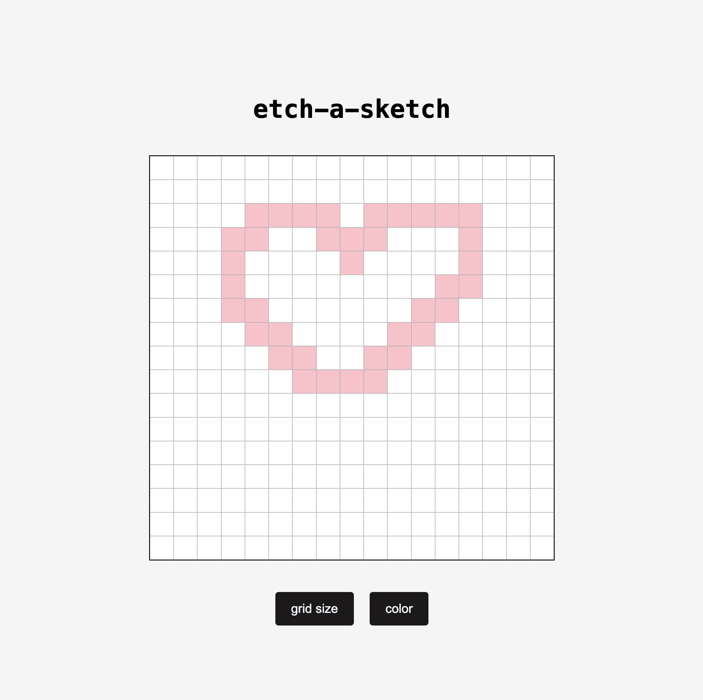

# Etch-a-Sketch

A browser-based Etch-a-Sketch drawing app built with HTML, CSS and JavaScript as part of The Odin Project.

## Preview

## Live Demo

[Try the Etch-a-Sketch](https://a41ya.github.io/odin-etch-a-sketch/)

## Features

* Dynamic drawing grid
* Custom grid size from 1×1 to 100×100
* Black and pink color modes
* Rainbow mode with random RGB colors
* Mouse hover drawing
* Grid size and color selection popups
* Start with a 16×16 grid

## Built With

* HTML
* CSS
* JavaScript
* Flexbox
* DOM manipulation
* DOM events
